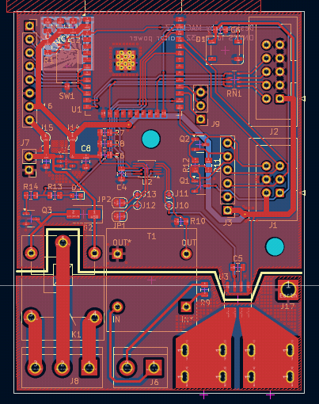
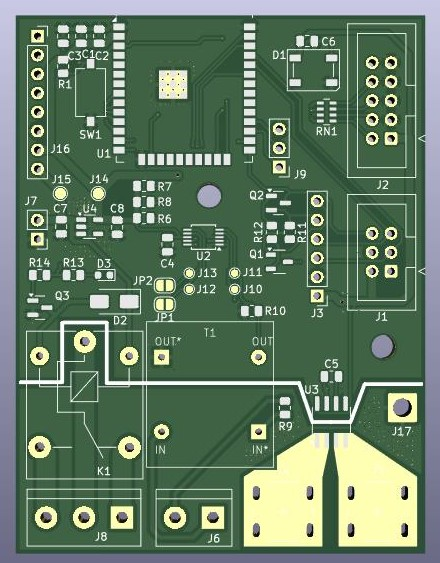

## ESP32 power meter

Based on:

* ACS712 - 30A
* 2ma - 2ma voltage measuring transformer
* ADS1115 - I2C ADC 16bit

Programer:

* [ESP-prog](https://docs.espressif.com/projects/esp-iot-solution/en/latest/hw-reference/ESP-Prog_guide.html)

### TO DO:

- [x] Add prog connector and essentials for esp32
- [x] Add pads for Isens
- [x] Add voltage sensor
- [x] Change footpirnts
- [ ] Test ad-dc converter
- [x] Add relay
- [x] Add extra outputs (5V, sig, GND)

### PCB V1 (not for production):

* [schematic](img/V1/schematic_v1.pdf)
* [bom](fab/V1/ibom.html)
* PCB

### PCB V2:

---

Author: Maciej Załęski [macmysz]