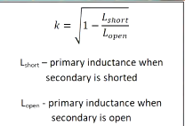

### Voltege transformer simulation

#### Transformer parameters

* $L_{1open}=L_{2open}= 0,6H$
* $L_{1short}=L_{2short} = ?$
* $R_{series} = 120\Omega$
* $N_1$ to $N_2$ ratio $= 1:1$
* $N_1$ to $N_2$ number of turns $= 1000 : 1000$
* Maks current throug winding $= 3mA$
* $k = ?$ from:

---

#### links
* [modeling transforme in LTspice - FesZ electronics](https://www.youtube.com/watch?v=muUwe8X51oY)