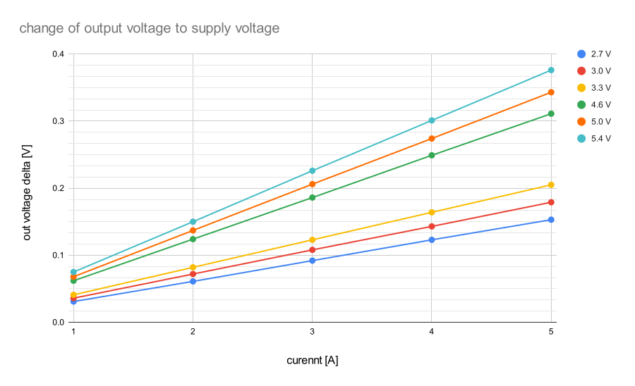

## Current sensor testing

ACS712

### Supply Voltage
Measurments in 3V supply range (this voltage supply is out of datasheet tolerance):

| supply voltage | current [A] | 2.7   | 3.0   | 3.3   |
|----------------|-------------|-------|-------|-------|
| out            | 0           | 1.351 | 1.502 | 1.653 |
| out delta      | 1           | 0.031 | 0.036 | 0.041 |
|                | 2           | 0.061 | 0.072 | 0.082 |
|                | 3           | 0.092 | 0.108 | 0.123 |
|                | 4           | 0.123 | 0.143 | 0.164 |
|                | 5           | 0.153 | 0.179 | 0.205 |

Measurments in 5V supply range (this voltage supply is within the typical datasheet tolerance):

| supply voltage | current [A] | 4.6   | 5.0   | 5.4   |
|----------------|-------------|-------|-------|-------|
| out            | 0           | 2.303 | 2.501 | 2.701 |
| out delta      | 1           | 0.062 | 0.068 | 0.075 |
|                | 2           | 0.124 | 0.137 | 0.150 |
|                | 3           | 0.186 | 0.206 | 0.226 |
|                | 4           | 0.249 | 0.274 | 0.301 |
|                | 5           | 0.311 | 0.343 | 0.376 |

