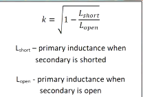
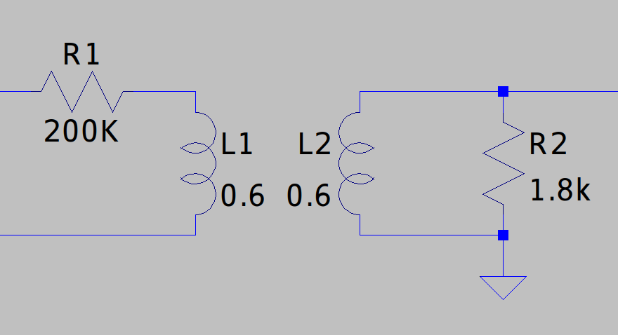
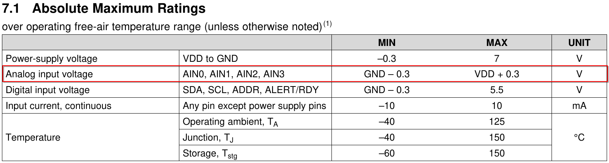

## Voltege transformer simulation

### Transformer parameters

* $L_{1open}=L_{2open}= 0,6H$
* $L_{1short}=L_{2short} = 43mH$
* $R_{series} = 120\Omega$
* $N_1$ to $N_2$ ratio $= 1:1$
* $N_1$ to $N_2$ number of turns $= 1000 : 1000$
* Max current throug winding $= 3mA$
* $k = 0.965$ from:

#### R1 and R2 values

For voltages $U_{prim} > 220V$, operating current range of primary side should be $1mA \leq I_{prim} \leq 2mA$ to reduce power loss on R1. 

calculated values:

* $V_{prim(pp)} = 325V$
* $V_{prim(RMS)} = 230V$
* $I_{prim(RMS)} = 1,15mA$
* $R_1 = \frac{V_{prim(RMS)}}{I_{prim(RMS)}} = 200K\Omega$
* $R_2 = 1,8K\Omega$ 

**add calc later!!**

Power dissipated on a R1 resistor is around 500mW. Power rating of R1 should be at least 2x higer, ideally up to 4x.

### ADS1115

**The ADS1115 input voltage range is limited between GND and VDD**, so AC-coupled signal measured from transformer needs to be level-shifted(baiased) to VDD/2.

---

### links
* [modeling transforme in LTspice - FesZ electronics](https://www.youtube.com/watch?v=muUwe8X51oY)